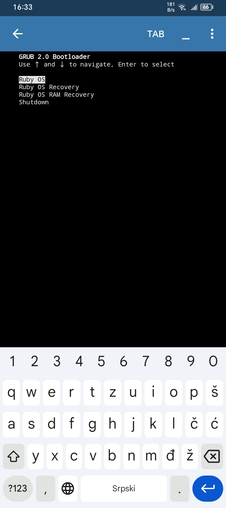
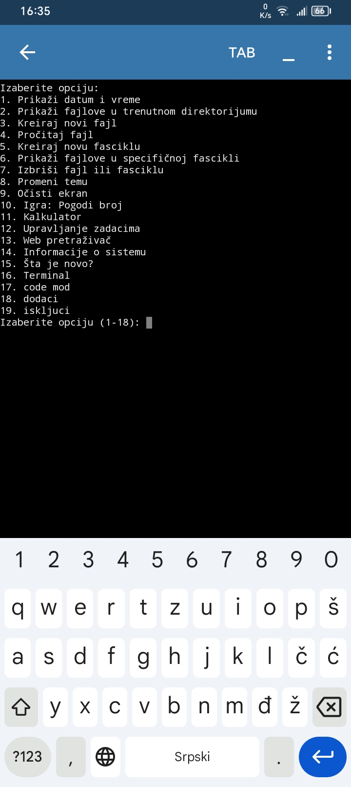

# RUBY

Ruby OS ⚙️💻

Super lagani operativni sistem za stare mašine

Ruby is my os programmed in python. If you don't know Serbian, I recommend a translator because the system is in Serbian.

Bugs:

🐞 RESET promenljiva sadrži višak ' na kraju:

RESET = "\033[40m'"

---

🐞 Neispravan uslov u XHack meniju (razmak ispred broja):

elif choice == " 17":

---

🐞 Poziv funkcije programiranje() u terminalu – ali funkcija nije definisana:

elif choice == 'code':
    programiranje()

---

🐞 Nepostojeća funkcija konami_easter_egg():

elif choice == "konami":
    konami_easter_egg()

---

🐞 Neispravno ime promenljive sysfiles (nije definisana) u kernelres():

with open(sysfiles, 'w') as f:

---

🐞 os.times().elapsed ne postoji – baca grešku:

uptime_seconds = int(os.times().elapsed)

---

🐞 Potencijalno beskonačna petlja u ram_recovery() ako random stalno ne uspe:

while True:
    if random.randint(1, 100) <= 50:

---

🐞 html() nema timeout i može da se zamrzne bez interneta:

response = requests.get(url)

---

🐞 ROOT_STATUS_FILE se zapisuje direktno bez provere putanje ili privilegija:

ROOT_STATUS_FILE = "root_status.txt"

---

🐞 Ne postoji fallback ako USERS_FILE nije u pravom formatu – može izazvati ValueError:

stored_username, stored_password = user.strip().split(',')

grub appearance:

OS appearance:

Želeo bi da čujem od vas!
gmail : ognjengaming52@gmail.com 

