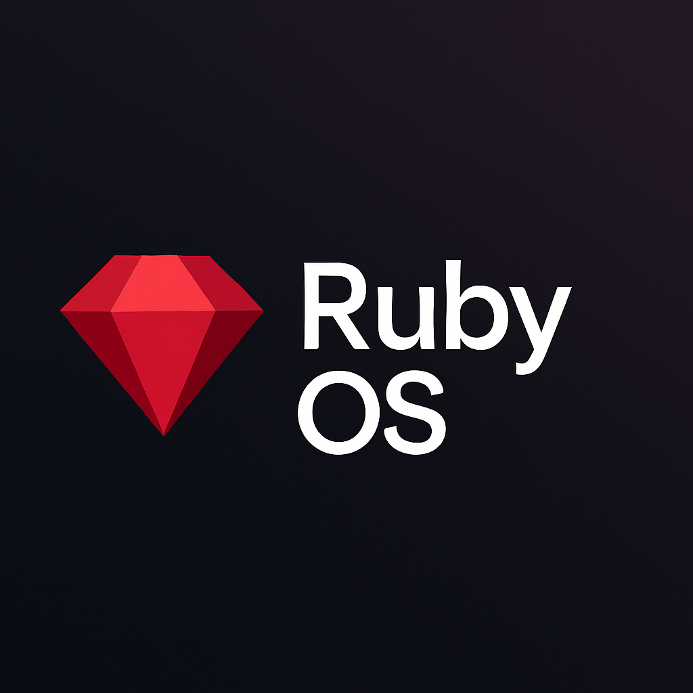

# 🔴 Ruby OS

**Ruby OS** is a retro-style, Python-based simulated operating system that mimics the behavior of real-world OS environments while running entirely in a terminal or basic graphical interface. It's lightweight, fun, and educational — perfect for learning how operating systems work or building your own software inside a safe, customizable shell.

> ⚠️ **Note**: Ruby OS is not a true low-level operating system. It runs on top of Python and is a simulation intended for learning and experimentation.

---

## 🚀 Overview

Ruby OS features a fully interactive Python-powered shell environment, complete with:

- A **custom bootloader simulation** (`EBOOT.py`)
- Core apps like **Notepad**, **Paint**, and a **Terminal**
- File and user space management
- A modular, folder-based architecture
- Built-in support for user extensions, games, and scripting

Ruby OS is designed for old-school computing lovers, young developers, and hobbyists who want to **build**, **break**, and **tinker**.

---

## ✨ Features

- 🧠 **Python-powered architecture**  
  Everything is written in Python and easy to read, modify, and extend.

- 🖥️ **Simulated boot process**  
  Experience an old-school bootloader and kernel loading system.

- 📝 **Notepad app**  
  Basic text editing functionality with save/load support.

- 🎨 **Paint app**  
  Draw pixels using characters in a grid-based paint utility.

- 💻 **Terminal with command system**  
  Custom terminal that supports built-in commands like `help`, `ls`, `cd`, etc.

- 👤 **User space separation**  
  Files and configurations are organized by user-defined space.

- 🎮 **Games and fun utilities**  
  Play mini-games and run apps inside the OS environment.

- 🧩 **Extensible & modular**  
  Developers can add new apps or modify the OS with ease.

---

            

OS logo:

grub appearance:

OS appearance:

